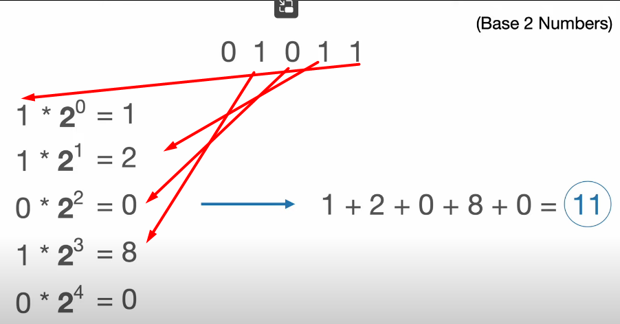

# Table of Contents
1. [Getting Started](#getting-started)
    - [Execution JS Program](#execution-js-program)
    - [Event Loop](#event-loop)
2. [Event Emitter](#event-emitter)
3. [File System](#file-system)
4. [Buffers](#buffer)
    - [Binary Data](#binary-data)
    - [Decimal Numbers](#decimal-number)
    - [Hexadecimal Numbers](#hexa-decimal-numbers-base-16)
    - [Why hexadecimal is required](#why-hexadecimal-is-required)
    - [Character Set](#character-set)
    - [Encoding Character](#character-encoding)
    - [Buffer in JS](#buffers-in-js)
5. [Streams](#streams)
    - [Writable Stream](#writable-stream)
    - [Readable Stream](#readable-stream)
        - [Reading Modes](#two-reading-modes)
    - [Pipe](#pipe)
    - [Duplex Stream](#duplex-stream)
    - [Transform Stream](#transform-stream)
    - [Stream Mode](#streams-mode)

# **Getting Started**

## **Execution JS Program**
-----------------------------

JavaScript Engine: JavaScript code is converted into Machine Code(001100). 

Node.js uses V8 Engine of Chrome.

Why TypeScript is better than JS. Because in JS is in c++ in c++ you define variable with datatype and that datatype does not changes. While in JS you there is no datatype is used

In JS
```
let a = 5;
a  = "String";
```
In C/C++
```
int a = 5
a="xyz"     # not allowed to change datatype
```

here V8 has do do some extrawork to perform deoptimization the code so it is slowed compared to typescript.

When you execute any in-built function. in js under the hood it calls c++ code to excute those function.

```
Pseudo code

C++ file 

#include<v8>    #include v8 code

void js_file_fn(){
    c++ code for file funciton
}

int main(){

    v8.bind(js_file_fn) #links fucntion to v8
}

-------------------

in javascript console: js_file_fn()

```

## **Event Loop**
-------------------------------
http://latentflip.com/loupe/

Event Loop: It co-ordinates work b/w call stack and the callback queues.

When you get computationally expensive operation. Main thred gets block.


```
console.log("Before")

fs.readFile("./abc.txt",(err,data)=>{
    if(err) throw new Error();
    console.log(data)
})

console.log("After")

```
In above case:
- Event Loop will execute "Before"
- Now readFile is **async** function. So eventloop will give task to libuv and continues to next part of code 
- Event loop takes next part of code and executes "After".
- Once libuv done with its task. It message gets pushed on Event Queue and Event Loop takes one message after another from event queue and executes callback for that async task.

https://www.youtube.com/watch?v=KKM_4-uQpow&ab_channel=UtahJS

|  | 
|:--:| 
| *Real Event Loop Architecuture* |

|  | 
|:--:| 
| *Internet Event Loop Architecutre* |


# **Event Emitter**

Imagine OS with Keyboard. In order to get input from keyboard there are 2 Ways: Synchronous and Asynchronous.

1. Synchronous: You allocate one cpu to constantly check for the keyboard.
2. Asychronous : Whenever input is given keyboard will tell cpu what to do. It can be events.


# **File System**


In node.js libuv library handles file operation for Node.js.

3 Ways Files Operations can be done:
- Promises APIs (Prefer this one mostly)
- Callback APIs
- Synchronous APIs (Avoid using bcoz blocks main thread)

when you read file it start pointer from last read position. e.g. f2.js


# **Buffer**

## **Binary Data**
-----------------------------

0 and 1

1 Bytes = 8 Bits (00110011)

Binary Number has base 2.

|  | 
|:--:| 
| *Binary with Base 2* | 


## **Decimal Number**
---------------------------
e.g. 100 oranges means 100 is represented in decimal. octal for that is 0x64 it doesn`t means that you have 64 organges you have 100 oranges.

|  | 
|:--:| 
| *Decimal to other conversion* |   


## **Hexa Decimal Numbers (Base 16)**
----------------------------------

**0x** is added in front of number. They also have number from 0 to 9 and A to F (total of 16 number/character)

|  | 
|:--:| 
| *Hexadecimal Calculation* |


## **Why hexadecimal is required**
------------------------
It uses less number of character compared to binary to represent same number.

Usage
- HTML colour #FFFFFF here you use # to indicate it is hex
- In URL %20 means space
- Unicode characters


|  | 
|:--:| 
| *Hexadecimal uses less no. of character to represent same number compared to binary* |


## **Character Set**
---------------------------------
Each Character,Letter or Symbol ==> mapped to Number

Unicode : It has 1,44,679 Characters.

| Unicode      | Representation in decimal | In Hex |
| ----------- | ----------- | -------- |
| s      | 115       | 0x73 |
| S   | 83        | 0x53 |


ASCII : It has only 128 character. lowercase, uppercase a-z and punctations. It is a subset of Unicode so "s" and "S" gets same representation.


## **Character encoding**
---------------------
e.g. utf-8, utf-16 


| Binary to UTF-8 and UTF-16 | |
| ----------- | --- |
| Decimal      | 115       |
| Hexa | 7
| Binary | 0111 0011 |
| UTF-8   | s        | 
| UTF-16 | 瑳 |


## **Buffers in JS**
-------------------------

It is a container in memory that has fixed lenght size.It stores raw binary data i.e. 0s and 1s.

Buffer is of 2-bytes means 2*8(16) bits are stored.

In JS Buffer is represented in Hex e.g "st" = <Buffer 73 74 00 00> here encoding is utf-8. "s" corresponds to 73 and "t" corresponds to 74.


# **STREAMS**

Whenever we have Data-Flowing means we have Stream of Data.

Data comes in small chunks and you perform some operations on chunks. As more chunks of data comes you continue. Without waiting for all the data to come and wait.

E.g. for reading 50 GB file data. You cannot load 50 GB into RAM. Instead you can load data in RAM in chunks of x MB then read it.

You wait till the size of chunks once you have size of chunks then write data to os or another process.

- **Writable Stream** :  write data in chunks.
- **Readable Stream** : read data in chunks.
- **Duplex Stream** : Both Read and Write data at same time.
- **Transform Stream** : Want to process data in between or before writting. E.g read data -> encrypts data -> write data to file.


## **Writable Stream**
--------------------------------

Each writable stream has interanl buffer( 16 kb ). It has also has methods, events and properties. 

**stream_obj.writbaleHighWaterMark** gives size of buffer. Also **stream_obj.writableLength** property tells how much buffer is filled.

As you write data it gets stored in Buffer. Once buffer gets fulled. You write all the data of buffer to destination in one go.

Instead of writting data 8 times to the disk. You collect it and write in single call/write.

|  | 
|:--:| 
| *Writable Stream* |


What if you tries to write data greater than size of writable stream internal buffer. In that case, pushed the data equal to internal buffer and remaining bytes of data gets stored somewhere in memory and node.js keep track of it. When buffer of writable stream gets emptied it pushes remaining data to Internal Buffer.

If you have 1 GB and internal buffer is 100MB then with stream 100MB will be in internal buffer but remaining (900 MB  = 1 GB - 100 MB) will be in RAM. So **memory usage will be 900 MB which we do not want.**


The **drain** event is for when a writable stream's internal buffer has been emptied.

This can only happen when the **size of the data buffer that you want to write once exceeded its highWaterMark property**, which is the maximum bytes of data that can be stored inside a writable stream's internal buffer until it stops reading from the data source.

|  | 
|:--:| 
| *Writting more than size of buffer* |


## **Readable Stream**
-------------------------

In Readable Stream when you want to empty buffer **stream.on('data',(chunk)=>{})** is used. Default **highWaterMark** value is 64 KB.


|  | 
|:--:| 
| *Readable Stream* |


In Readable Stream you will automatically have **stream.on('end')** event once reading is done. While in Writable Stream you will have manually emit **stream.end()** after that you will enter in  **stream.on('finish')**.


### **Two reading modes**

2 Modes:
- **Flowing :** data is read from the underlying system automatically and provided to an application as quickly as possible using events via the EventEmitter interface. **pipe** is used
- **Paused :** method must be called explicitly to read chunks of data from the stream. Like stream.resume() and stream.pause()


The Readable can switch back to paused mode using one of the following:

- If there are no pipe destinations, by calling the stream.pause() method.
- If there are pipe destinations, by removing all pipe destinations. Multiple pipe destinations may be removed by calling the stream.unpipe() method.


## **Pipe**
----------------

Similar to pipe in Unix. In node.js Pipe only takes **Readable Stream as source** and you pipe data to writable stream or perform some transformation in between then to destination.

synatx : readable_stream(writable_stream1, Transform1 , destinaton)

**Problem with Pipe :** Less Error handling so use **pipeline API** of node.js for better error handling.


# **Duplex Stream**


It can do Read and Write both at a same time. It has **2** buffer one for Reading and another for writting. You could have one buffer reading data from another source and second buffer writting data to different source.

Both buffers are completely isolated. 

Implemented using {Duplex} class by extending it.


|  | 
|:--:| 
| *Duplex Stream* |


# **Transform Stream**

It is similar to Duplex Stream but It reads data and writes back to write internal buffer then it becomes transform stream. Special case of Duplex Stream.


|  | 
|:--:| 
| *Transform Stream* |


# **Streams Mode**

Instead of moving data in form of buffer 0s and 1s. You can move data in Object mode like JavaScript Object mode. Useful in like moving Datbase Record value library like pg-node and pg-query-stream uses object mode.


Library Stream search, busboy(this is used by multer as their dependencies) uses stream take a look at source code for learning more about stream


