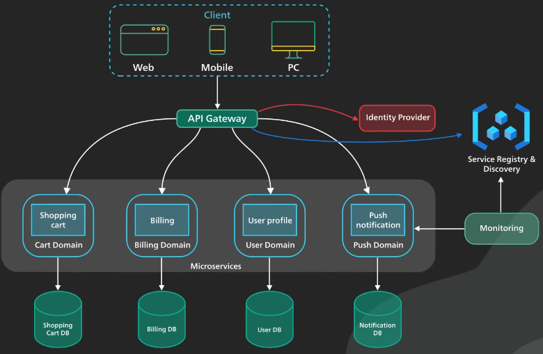

# Table of Contents

1. [Microservices](#microservices)
    - [Why required](#why-required)
    - [Advantage](#advantage)
    - [Problem](#problem)
    - [Tool used for building](#popular-toolstechnologies-used-for-building)

# **Microservices**

## **Why required**

As the application becomes complex it becomes difficult to scale and manage. 

For e.g. You have shopping website and you know that only payment and search functionality is getting load. So, in traditional you do horizontal scaling by making multiple instance of you website.

**Problem** : You are un-necessary copies all the code to just scale 2 functionality.

**Solution** : With microservice. You de-couple those 2 functionality and develop them as micro-service. You just have scale those 2 micro-service instead of whole application.

**When to use**
- When you have very complex application and becomes difficult to maintain and scale.

**When Not to use**
- You have really small application and less resources.

|  | 
|:--:| 
| *Microservce with each service and theri own Database* |

 

## **Advantage**

- Each micro-service can have their own programming language and database.
- Easy to scale and manage.
- Each service can be deployed on different cloud

## **Problem**

- Communication between multiple services
- Service discovery means to find whether that node is up and running.(questions like:  where is my picture api where is my profile apit)
- Hard to find problem

## **Popular tools/technologies used for building**

- **Contanerization** : docker is used for deployment of application because of lightweight and can be scaled quickly.
- **Kubernetes** : Used for auto-scaling when there is load and taking down container when not enough load. Automatically load-balancing. In normal when you change code in one container you need that code changes in all the container. Instead of doing it manually in container one by one. Kubernetes take care of that.

- **Pipeline Automation** : Gitlab and Jenkins
- **Communication** : Through RPC(like or gRPC REST API) or using messaging(Kafka)
- **Performance Monitorin** : Prometheus
- **Logging and Data Audit** : DataDog

