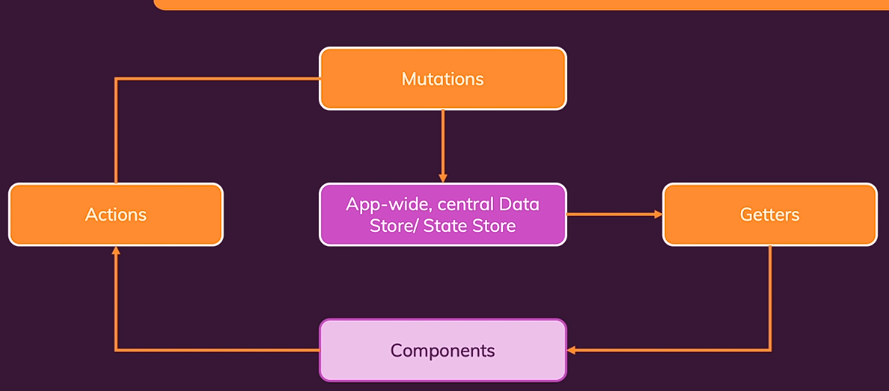

## Data output in dom

- For HTML tag use double curly brackets {{ value }}
- For attributes (inside html) use v-bind instead of double curly brackets. e.g. in href of `<a href>` tag
- For output html content use "v-html" directive
- shortcut for b-v-bind is `:href=`

```
 data(){

        return {
            courseGoal : "Finish the course and learn vue",
            vueLink : 'https://vuejs.org/',
            outputGoal : "<h2> Hello Ouptut Goal in HTML </a>"
        }
    }

```

```
<section id="user-goal">
      <h2>My Course Goal</h2>

      <p>{{ courseGoal }}</p>

      <p> Learn more  <a v-bind:href="vueLink" > Click here </a></p>

      <p v-html="outputGoal" > </p>

    </section>

```


## Methods

you want to execute function like in case of some user events click

to access values defined in data block use "this" keyoword

```
methods : {

    foo(){
        # 1st way to define

        # to access values defined in data block
        this.courseGoal
    },

    bar : function () {
        #2nd way to define
    }
}
```

## Events Binding

### Click

- To listen to event use "v-on" directive
- You can pass argument to function like in js `v-on:click="add(5)"`

- Shortcut use @ symbol `@click = add(5)`

```

<button v-on:click="counter++"> Add </button>

OR

Calling by function name

< button v-on:click="add" > or add() both works </button>

---------------------------


methods:{
    add(){
      this.counter = this.counter + 1;
    }
}


```


### Input box

- In case you want to pass extra argument then(last name) then `$event` is passed as first argument and rest of all are users arguements

```
    <input type="text" v-on:input="setName($event, 'Gajera')">
    <p>Your Name is {{ name }}</p>

-----------------------------------------------

    setName(event,lastName){
      this.name = event.target.value + " " + lastName
    }
```

### Event Modifier

- To prevent default behaviour of form (i.e. sends data to server) 2 ways you can solve this problem
    - use  `event.preventDefault()` in your event listener methods
    - use `v-on:submit.prevent` modifier in attribute of html

- If you want to listen to only left click then use `v-on:click.left`


### v-once

You want to the value to be changed once only after that value should be locked and cannot be changed. (use when you have same variable name but you want to change the value once)


### Data + Event Binding (2 way binding)
 
- here you are binding value with `v-bind` and event with `v-on` meaning whenever event occurs it gets value gets refelected and whenever value changes it gets filled input box

```
    <input type="text" v-bind:value="name" v-on:input="setName($event, 'Gajera')" >

    <p>Your Name is {{ name }}</p>

```

Solution 

`v-model` is shortcut for combination of  v-bind:value and v-on:input methods

```
    <input type="text" v-model="name">
    <p>Your Name is {{ name }}</p>
```

### ref attribute

- It points to DOM element used for value retrivale using `$refs.abc` method in JS. You want to access DOM elements and its method refs are used.

```
    <input type="text" ref="foo">

-----------------------------------------------

    this.message  =  this.$refs.foo.value

```

### Reactivity

- Here ther is one problem whenever you call `click event reduce()` method. Logically it should only update `<p> tag with counter` but it also call `outputFullName()` method every time counter values changes because vue does not have idea what this method do and which value it changes. (non-event binded method will be executed every time when some thing changes)

```
      <button v-on:click="reduce()">Reduce</button>
      <p>Result: {{ counter }}</p>

      <p>Your Name is {{ outputFullName() }}</p>

```

**Problem**
- Output value (that has computation like string concatenatnion, addition) through function call is not ideal because it get executed every times something changes and bad for performance.

**Solution**
- use computed property and points to that name in html

```
  computed:{
    
    fullname() {
      if(this.name===""){
        return "";
      }
      return this.name + " " + "Gajera"
    }

  },


  --------------------------------

  <p>Your Name is {{ fullname }}</p>
 
```


### Watchers


**Real Usecase** : For example when counter values goes beyond 50 then reset to 0. or When some data changes send HTTP request. Do not use it for dynamically output value (use computed property)

- A Function to execute when one of the dependencies is changed. Use `watch` property.
- Here whenever the name property changes it calls the function

```
data(){
    return {
        name: "",
        fullname: ""
    }
}

watch:{
    name(currentvalue, previousvalue){
        this.fullname = currentvalue " " + "gajera"
    }
}
```

**Problem**
- Here we are watching only single property. Now if you have 2 inputs first and last name. Based on that you want to output full name. Then you need to create 2 function for each individiual property.


## Dynamic CSS

- Create a computed property variable like true or false. If true then style is applied else remove the style

```
<h1 :style="{borderColor : isBoxSelected ? 'red' : 'blue'}>

```

- Use class attribute

```
    :class = "{ active: isBoxSelected } "

    Multiple class
    -----------------------------------------

    :class = " ['class1' , { active: isBoxSelected }] "
```


## Conditional and List Rendering


### IF - Else

- it adds and remove elements from DOM

```      <p v-if="goals.length === 0">No goals have been added yet - please start adding some!</p>

      <ul v-else-if="goals.length > 0">
        <li>Goal</li>
      </ul>

      <p v-else> ... </p>

```

### V-show

- It just hides element with display:none but never removes element. Good for performance 

```
<p v-show="length > 0"> ... </p>
```

### For Loop

- use key attribute to prevent weird bugs `:key="key_value"`

```
<li v-for="goal in goals" :key="goal"> {{ goal }} </li>

<li v-for="(goal,index) in goals" :key="goal"> {{ goal }} </li>

give list of 0 to 9 numbers
<li v-for="num in 10" :key="num"> {{ num }} </li>


<li v-for="(value,key,index) in {name:'max', age:20}" :key="value"> {{ key }} and {{ value }} </li>

```


## Vue basics and under the hood

- If you have 2 different vue apps object(mounts on different dom) then it behaves independetly of each other.

### Vue Life Cycle

|  | 
|:--:| 
| *Vue Life Cycle* |


- If you want to access those methods just add inside methods: {} blocks in Vue app

for e.g. to access beforeCreate() life cycle method like

```
methods : {

    beforeCreate(){
        console.log("Before create method called)
    },
    
    created(){

    },

    beforeMount(){

    },

    mounted(){

    },

    beforeUpdate(){

    },

    beforeUnmount(){

    },

    unmounted(){

    }
}

```
## Better working enviroment (Vue CLI)

- Install Vue CLI
- type command `vue create my-first-app`
- cd to location
- Install dependencies `npm install`
- `npm run serve` to run application

- use Vetur extension


## Components

- Resuable Part (Splitting big application into small)
- When you want certain functionality specific to that block of HTML only.


```
app.component('friend-contact', {
  template: `
  <li>
    <h2>{{ name }}</h2>
  </li>
  `,
  data() {
    return {
      detailsAreVisible: false,
      name : "viren",
    };
  },
  methods: {
    toggleDetails() {
      this.detailsAreVisible = !this.detailsAreVisible;
    },
  },
});


-------------------ACCESS IN HTML---------------------

<friend-contact> </friend-contact>

```

- Store all your components in src/components/mycomponent1.vue


**Defining Component (In a seperate file .vue file)**

```
<template>
    <li>
        <h2>{{friend.name}}</h2>
    </li>
</template>


<script>
export default {
    
    data(){

        return {
        }

    },

    methods : {
        toggleDetails(){
        }
    }
}
</script>

<style>
    li {
      background-color : "blue"
    }
</style>

```

**Registering Component**

```
import friend from ...

app.component('friend-contact',friend)

```


## Parent - Child communication (Props)

- In parent component data is passed as attributes


```
PARENT Component (Static way of passing props)
--------------------------------------------

<template>


      <friend-contact
        name="Manuel Lorenz"
        phone-number="01234 78992"
        email-address="manuel@localhost.com"
      ></friend-contact>

</template>

```


- To access data in child component you need define that `props` in child component properties and you can access those values
- Props passed as `phone-number` is access through camelcase way `this.phoneNumber`


```
CHILD Component
--------------------------------------------
<template>
  <li>
    <h2>{{ name }}</h2>
  </li>
</template>

<script>
export default {

  props: [
    'name',
    'phoneNumber',
    'emailAddress'
  ],

  data() { }
}

```

- You cannot change the value of props in the child component logic. You are allowed to change values in parent components that reflects into child. (It violates rule of Unidirectional data flow)

- But there are 2 way to change the data 

**1st method** : You maintain another variable in child components that stores the intial value of props. You change the value of that local variable. As it will get reflected in that component only.

```
here isFriend is props value passed from the parent to child

you modify the value of newIsFriend value

data(){
  return {
    newIsFriend : this.isFriend
  }
},

method:{
  change(){
    this.newIsFriend = false
  }
}

```

## Validation of Props

- default value can be passed
- required or not can also be defined
- validation is possible with `validator()` function defined

```
  props:{

    phoneNumber : String,

    name : {
      type:String,
      required : true,
      default : "Viren"
    },

    emailAddress : {
      type : String,
      validator : function(value){
        if(value == "viren@gmail.com"){
          return true
        }
        else {
          return false
        }
      }
    }

  },

```


## Dynamically binding Props Value

- in parent componet you have list of values and bind that values as props in child component

```
<friend-contact
  
  v-for = "friend in friends"
  :key = "friend.id"
  :name = "friend.name"
  :phone-number = "friend.phone" >

</friend-contact>

<script>

export default {

  data(){

    return {
      frinends : [
        {}, {}, {}......
      ]
    }

  }

}

</script>

```


## Emitting custom events (Child to Parent communication)


- Child components changes props data in Parent component
- Your child component emit events with necessary data
- Parent components has event implemented, it listens to event


```
Child Component : It calls event present on parent component
---------------------------------------

 <button @click="toggleFavorite">Toggle Favorite</button>

methods : {

  toggleFavorite() {
      this.$emit('toggle-favorite', this.id);
    },

}

Parent Component
------------------------------------

<friend-contact

        v-for="friend in friends"
        :key="friend.id"
        :id="friend.id"
        :is-favorite="friend.isFavorite"

        @toggle-favorite="toggleFavoriteStatus"

      ></friend-contact>

<script>

  methods: {
    toggleFavoriteStatus(friendId) {
      const identifiedFriend = this.friends.find(
        (friend) => friend.id === friendId
      );
      identifiedFriend.isFavorite = !identifiedFriend.isFavorite;
    },
  },

</script>
```

## Defining and Validating Custom Events

```
Child Component
------------------------------

<script>

  emits : ['toogle-favourite']

  or

  emits : {
    'toogle-favourite' : function(id){

      if(id) return true

      console.warn("ID is missig")
      return false
    }
  }

</script>

```

*************************
## **Provide + Inject (google it)**
*************************
- Use incase of passthrough component


## Global vs Local Component

**GLOBAL**

- When you define all the components in the global space then it has to load all the components when the page loads intially
- If you have more number of components then list and code becomes long


```
When you register components in main.js as

app.component('the-header',TheHeader)

You can access the component anywhere in the app by
just specifying <theHeader> </theHeader>

```


**LOCAL**

```
<template>

  <the-header> </the-header>

  or anther way to use in self-closing tag

  <TheHeader/>

</template>

<script>

import TheHeader from '../.'

export default {

  components : {

    'the-header': TheHeader

    or (another way of registering)
    
    TheHeader,

  },

  data(){

  }


}

</script>

```

## Scoped Styling

- **scoped styling** it applies to the current component template only. Not applies on child or parent component
- When you define in normal way it is applicable to globally to all the pages

```
<style scoped>

</style>
```

## Slots

- You want certain styles to apply multiple pages. Like Cards has shadow, rounded corner, background color. All the card should have some common style.
- Make another component (Base Component) and wrap everything around it
- Special tag available `<slot>` to inject html content in base card
- Also used in case you want different error message display and inject those message on base error card.

```
BaseCard.vue
--------------------------------------

<template>
  <div>
        <slot> </slot>
  </div>
</template>

<script>
export default {
  
}
</script>

<style scoped>
    div{
      background-color:blue
    }
</style>

```

- using base card (wrapper) in just like anther component

```
<template>

  <base-card>

      <h1>

  </base-card>

</template>

<script>
  import BaseCard from '././'

  export default {
    components : { BaseCard }
  }
</script>

```

**Named Slot** : If you want to have 2 slots in a single base component file. Then you need to give name to each slot

```
Base Card
-------------------------
<template>
  <div>

        <header>
            <slot name="abc"> </slot>
        </header>

        <slot> </slot>
  </div>
</template>

```
- In order to tell which part of content goes to which slot you need to give special attribute `v-slot:slot_name`. Shorthand operator `#slot_name`
- Rest of the content which does not fall under `v-slot` block goes to default slot (`v-slot:default` or `#default` is used to explicitly mention)

```

<template>

  <base-card>

    <template v-slot:header> or  #header for shorthand
          Goes to Header slot bloc
    <template>

    <h2> Rest of all goes to default slot </h2>

  </base-card>

</template>

```


## Scoped Slots

- To access props passed from slot to the content in child

```
CourseGoal.vue
--------------------------------

  <li v-for = "goal in goals" :key="goal">

      <slot  :item="goal"  another-prop="abc" >  </slot>

  </li>

```

```

import courseGoal form '...'

<course-goal> or just use <course-goal  #default="myProps"> in case of there is only default slot no need to use template

    < template  #default="myProps"  >   all the props are available in single object named myProps and you can access all the values

        <h2> {{ myProps.item.goalName }}  </h2>

        <h2>  {{ myProps['another-prop'] }}  </h2>

    </template>
    

</course-goal>


```


## Dynamic Components

**Use case** : You have 2 buttons(tabs) that shows active and manage goals tabs on clicking button. and that component should be displayed accordingly. Vue provide `<component>` tag to solve this issues

**Keep Dynamic Component Alive :** If you have input field in one of the component and after typing some value you changes tab. Again come back then that input field get lost (reseted). to solve this proble wrap your dyamic componet aroud `<keep-alive>` tag

```
<template>

  <button @click="setSelected('active-goal')" > Active Goal </button>
  
  <button @click="setSelected('manage-goal')" > Manage Goal </button>

  <keep-alive> optional in-case you want to solve issue related to prevent when input field is cleared

      <component  :is="selectedComponent" > </component>

  </keep-alive>

<template>

<script>
  
  here 'active-goal' and 'manage-goal' are components that need to imported and registred as component

  data(){

    selectedComponent : 'active-goal'

  }

  methods : {

    setSelected(cmp){
      this.selectedComponent = cmp
    }

  }

</script>

```

## Teleporting Elements (google it)

- `<teleport to="body">` : It will move html structure to specified location. Better for accessibility like used in case of Modal


## Working with Fragments

- You don not need to necessary wrap all your code inside `<div>` tag. You can have as many top level elements you want in your template code.


## Vue Style Guid (can be found in website)

- Folder structure : Keep base component, layout and group the components with similar (e.g like products) into single folder


## Working with HTML Forms

- with `v-model` you get proper type conversion (if input is type number then you get value in Number format)
- When you use `refs` and retrieve value then you get value in String format

- You can use `v-model` on custom component instead of html. Vue provide special events(`@update:modelValue`) and props (`:model-value`) when you define `v-model` on custom components


## Sending HTTP Requests

- Use Fetch API or Axios
- Trigger like on clicking button

- **Auto populate data when page loads:** : When page loads you want to fetch data and populate it without needing by clicking button manually. Possible by using `mounted()` (lifecycle event when component is mounted and ready to use) and inside this life cycle just call the method that fetches the data


# Multi-Page and SPA

- Install `npm install vue-router --save` package to install router in your vue application


## Routing Setup

- In main.js
- In configuration `routes` you define list of all possible routes URL and components to load with that URL
- `history` option how to manage history in app. createWebHistory() value is used for browser history

```
import {createRouter} from 'vue-router'

const router = createRouter({

  history : createWebHistory(),
  routes :  [

    { path : "/teams", component : TeamList}
    
  ]  

})

app.use(router)

app.mount('#app')

```

- In ordert to tell vue where to load the router component you need to explicitly tell with `<router-view>` in App.vue
- Also in that file you do not need to import and register component because we have already done that part while regestering

```
ABC component.vue
------------------------------

<template>

    <router-view> </router-view>

</template>

```


## Navigating with Router Link

- You want to add link and href so that you can have navigation. `<router-link>` under the hood uses anchor tag with slot
- It has `to` attribute which takes path to navigate

```
<ul>
  <li>  <router-link to="/home" >  Home </router-link>  </li>

  <li>  <router-link>  About Us </router-link>  </li>

```

## Styling with Router link

- Vuejs provide special class that are used to determine that class is active or not and based on that you can provide styling

`a.router-link-active` : This matches "teams" even if you have nested routes likes `/teams/id=9`

`a.router-link-exact-active` : It matches exactly with path


- You can change the class for example you want to just have `active` name instead of long name. Then you need to configure in the while defining router in main.js file


## Programmatic Navigation

- **Use case :** You have button like after clicking registering you want to redirect to home page. OR next and last page kind of navigation.  You need to use `this.$router`

- There are methods available like forward, back, push

```
methods :{

  registerUser(){

    #on successfull event you want to redirect user to login page

    this.$router.push('/login')

  }
}
```


## Dynamic Passing data with routes parameters

- To have `/teams/1 or /teams/2` means to load teams with id 1 or 2 those are dynamically

- Here order of placing matters

- props : true  ==> tell vue to pass the dynamic value as props instead of manually passing in the parent component

```
You need to register that route in the main.js as

routes : {

  {path : '/teams/:teamID', component : TeamMember, props : true }

}
```

- You can access URL parameter value in the component with `this.$route.parmas.param_name`

- When you go back and forth the vue does not destroy and re-create components again. Instead it caches so no new changes are reflected. So, by just defining in created() method does not work because component will be created once only and you will not able to navigate (data will be not loaded). To prevent this you also need to watch method and whenever it changes you again re-renders the component. 

```
props : ['teamID']    #teamID is coming as props from route we defined

methods : {
  loadTeamMember(teamID){

      let team = find by teamID

      once all the data is filtered you can modify the data() variable and render that component

  }
}
created(){

      this.loadTeamMember(this.teamID)
},

watch : {

  teamID(newID){
      this.loadTeamMember(newID)
  }
}
```


## Naviagation Link for Dynamic Path

- You want to click on button where you will get the data for specific team dynamically

- You need to pass value like "id" from the parent component as props

```
here id comes as props

<router-link :to=" '/teams' + id "> View teams </router>

you can also use computed() property instead on mention logic in HTML tag

```


## Catching Error and Redirecting to 404 page

```

{ path : '/', redirect:'/home' }    # URL changes


{ path : '/teams', component : TeamMember , alias:'/' }    # URL not changes

{  path : '/:foo(.*)' , component : NotFound }  # any character combination regualar expression is used so at the end it does not matches it should load specific componet or redirect

```


## Nested Routes

- Routes inside Route
- You want the view all the team members on the same page instead of taking it to the new Page
- `children` : property is used

```
routes : [

  {
    path : '/teams',

    component : TeamList,

    children : [

      { path : ":teamID", component : TeamMemebr , props : true }

    ]
  }
]
```


## Named Routes and Location Objects

- In real-world you will have hundred of routes you cannot add all the entries and manage those routes.


## Query parameters

- `/search?name=hello`

Accessing value by `this.$route.query`


## Multiple Routes


## afterEach and beforeEach Guard

## beforeRouteLeave() Guard
- Used to prompt when accidently user switches tab or goes back and you want to prompt user that data will be not saved or. Similar kind of situation

## Route Meta data

## Organize Route Files

- create router.js file and place all the router logic in that


# Vuex

- `npm install vuex --save`


|  | 
|:--:| 
| *Vuex* |


## Creating and Using State

- You need to create VuexStore to store data. 
- Only one store is allowed per App

```
in main.js
---------------------------------
import {createStore} from 'vuex'

const store = createStore({

  state(){
    return {
      counter : 0
    }
  }

})

app.use(store)

-------------------------------------

Using in Store value in Component

<template>
    {{ $store.state.counter }}
<template>

```

## Mutations in Vuex

|  | 
|:--:| 
| *Mutation in Vuex* |


- In order to change Vuex state. It can introduce error as anyone can update this state by its own way.
- So Mutation are methods that contains logic how to update the state. So you change state by calling mutation. All the components has to do this way only.


```
in main.js
---------------------------------
import {createStore} from 'vuex'

const store = createStore({

  state(){
    return {
      counter : 0
    }
  },
  mutations : {

    foo(current_state){

        state.counter = state.counter + 2

    }
  }

})


---------------------------------------

Triggering mutation in Component

methods : {

  addTwo(){

    this.$store.commit('foo')

  }
}


```

## Passing data in Mutation

```
in main.js
---------------------------------
import {createStore} from 'vuex'

const store = createStore({

  state(){
    return {
      counter : 0
    }
  },
  mutations : {

    increaseByN(curr_val, payload){

        state.counter = state.counter + payload.n

    }
  }

})


---------------------------------------

Triggering mutation in Component with argument

methods : {

  foo(){

    this.$store.commit( 'increaseByN', { n : 5 } )

    OR

    this.$store.commit({
      type : 'increaseByN',
      n : 5
    })

  }
}


```

## Getters in Vuex

- Access the value using some method(getters).
- 2 components can use the value with different way to display. For e.g. One component want to display value in lowercase and another in Uppercase. But you do not want to change Vuex state value


```
main.js
---------------------------------

mutations : {

},

getters : {

  #here getters object is used to call another getter in current getter

  finalCounter(state, getters){
    return state.counter * 3;
  }
}

--------------------------------------

Accessing in Component
--------------------------
You do not call the method you just point to it.

this.$store.getters.finalCounter

```


## Running or Updating state in Async manner with Actions

- Define "action" and action will trigger mutation method.
- So you can define async block in action and that action will commit mutation.
- It is considered good practice to have action block to commit mutation.

```

main.js
--------------------------------------------
mutations: {

    increment(state) {
      state.counter = state.counter + 2;
    },

    increase(state, payload) {
      state.counter = state.counter + payload.value;
    }

},
actions: {

    increment(context) {

      // async action commit that will change state
      
      setTimeout(function() {
        context.commit('increment');
      }, 2000);
    },

    increase(context, payload) {

      // sync action commit

      console.log(context);
      context.commit('increase', payload);
    }

},

-------------------------------------------------------------

In component you need to call action by dispatch 
-------------------------------------------------------
  methods: {
    addOne() {
      this.$store.dispatch({
        type: 'increase',
        value: 10
      });
    },
  }

```

## Map Getters in Vuex (Helper function)

- Avoid writting and calling getter method. Vuex has `mapGetters`

```
export default {
  /* computed: {
      counter() {
        return this.$store.getters.finalCounter;
      }
  }
  */

  Instead of making computed property to call getter method use mapGetters (with spread operator)

  ...mapGetter(['finalCounter'])
}

```

## Map Actions in Vuex

- Instead of calling actions with dedicated methods in component you can use `mapActions`


```
export default {
  methods : {
    /*
    addOne(){
      this.$store.dispatch('increment')
    }
    */

    Insted of defining method then calling action use mapActions

    ...mapActions(['increment'])

  }
}

```

## Organizing stores with Modules

## Local state in Module

## Namespace in Module

- To avoid name clash. Because in the end all the methods of local and global module are combined into one. So, use `namespace : true`

- If you have namespace with name "number" you can access by `this.$store.getters['number/increment']`


## Organzing files for Vuex

- Create folder with name 'store' and inside that create sub-folder for each store

/store/modules/counter/
    |                 |--- actions.js
    |                 |--- getters.js
    |                 |--- mutations.js
    |                 |--- index.js
    |
    |    /modules/auth/
    |
    |                 |--- actions.js
    |                 |--- getters.js
    |                 |--- mutations.js
    |                 |--- index.js
    |
    |--- actions.js
    |--- getters.js
    |--- mutations.js
    |--- index.js


# Authentication in Apps like SPA (Vue)

- Token is sent from the frontend when the request is sent
- Store the token in Vuex state (with necessary information like tokenid, userid) or Local Storage


# Optimize and Deploy Vue Apps

## Optimization using Async component loading

- Load component async using `const BaseDialog = defineAsyncComponent(()=> import('../component/..'))`
- Also applies in route.js because intially we do not want to all the components other than root or homepage route.

## Building application

- `npm run build`
- It will transform your vue js code into `dist` folder where code is generated so that browser understand


# Composition API

- Different way of writting component
- Only JavaScript code changes (completely optional), But defining props, emit remain same
- Template part of passing props, listening events, v-for and everything of template remains same

|  | 
|:--:| 
| *Vue Options APIs to Composition APIs* |


## Problem solved by composition API

- `Options API` we uses object and provide necessary configuration.
- **Problems with Options APIs**
  - **Problem 1 :** When component becomes too big it becomes difficult to manage. For example changing the data property you need to change logic in computed, methods and wherever this data property was used.
  - **Problem 2 :** Re-using component logic into another component becomes difficult(it is possible) in Options API. Like sorting and searching of list


- All the code of data(), methods, computed, watch are placed inside single setup() function of Composition APIs
- return are used to return all the things that needed to display in template. Otherwise if you are trying to access value which is not returned you will get error

## Replace data with refs


```
export default {

  props : [] # this remains same

  
  data() {
    return {
      userName : "Viren"
    }
  }

  # With composition API
  # setup method only run once

  import { ref } from 'vue'

  setup(){

    const userName = ref('Viren');    # It takes intial value. It is different from html ref

    # To change value you need to use .value property if you will change value noramlly by assiging it will be not reactive

    userName.value = "gajera"

    return { userName }

  }

}
```

- Working with objects are tricky
- To convert object propery also into reactive value use `toRefs(reactive_object)` method and you can access values directly in html template and those value will be reactive

```
setup() {

    const user = ref ( {

      name : "gajera",
      age : 24

    } )


    user.value.name = "vier"
    user.value.age = 20 

    return {user : user }   # in order to udate DOM (reactive) you need to **pass raw object not values** (user.value.age)

    
    ----------------- ALTERNATIVE SYNTAX to avoid typing obj.value.key  use reactive() ---------------------

    const user = reactive ( {

      name : "gajera",
      age : 20
    })

    user.name = "viren"

    return {user: user}

}

<template>

    {{user.name}} - {{user.age}}      # now object is available which is reactive to value change

<template>

```

## Replace method with Regular function

```
<template>

    <button @click="changeAge" > {{ age }} </button>

</template>


<script>

  import {ref} from 'vue'

  export default {

    setup() {

        cont age = ref(0)

        function changeAge(){

          age.value = age.value + 1

        }

        return  {age,changeAge }

    }

  }

</script>
```


## Replacing computed poperties with Computed function

- You need to import the computed
- computed function takes callback function as agrument and retuns somthing


```
<template>

    <h1>  {{ fullName }} </h1>

<template>

<script>

  import {  computed } from 'vue'

  export default {

    setup() {

        cont fullName = computed(function() {

          return "Viren" + "Gajera"

        })

        return  { fullName }

    }

  }

</script>

```

## Working with watchers in Compostion API

- You need to import watch
- It takes 2 arguments : value (ref object) to watch and call back function


```
<template>

    <h1>  {{ fullName }} </h1>

<template>

<script>

  import {  watch } from 'vue'

  export default {

    setup() {

        const firstName = ref('')

        watch(firstName, function(newValue, oldValue) {

            console.log("changed")

        })

        # Also possible to watch multiple values at the same time use array and you get array of values in arguments

        watch( [val1, val2] , function ( newValueArray, oldValueArray ) {})

        return  { firstName }

    }

  }

</script>

```

## Working with emit, props and slot

- setup method also accept arguments to access values as below

```
setup(props, context)

props : are used to access value of props passed from parent

context : are used to access attrs, slot, events to emit (to replace this.$emit you can use contex.emits )

```

## Provide and Inject in Options APIs

- You need to import `provide and inject` function
- Provide is a function that takes 2 argumetns : 1st is key and 2nd is the actual value
- Inject function takes key as agrument and returns the value

```
To provide value
----------------------------

const name = ref("viren")

provide('uName',name)


To inject value
----------------------------

const name = inject('uName')   # It will returns the value with specified key

age.value   # never change in this way in inject block always change from provide block

```

## Life cycle hooks in Composition APIs

|  | 
|:--:| 
| *Vue Lifecycle Options APIs to Composition APIs* |


- You need to import those methods

```
export default {

  import { onBeforeMount } from 'vue'

  setup() {

      onBeforeMount(function(){
        console.log("On Before")
      })

  }
}
```

## Router and Params in the Composition APIs

- In order to use params('/products/:id') you need to add `props` in router configuration and use provide and inject to find from the product list of values and display that result according to "id"

- In order to use `this.$route` in Composition API. you need to import `useLink, useRoute, useRouter` function provided in vue-router project

```
this.$route  in Options APIS

const route = useRoute() in Composition APIs

```


## Vuex in Composition APIs

```
this.$store in Options APIs

import {useStore} from 'vuex'

const store = useStore()

store.dispatch('increment')

```


# Code Re-usable Mixins (for Options APIs) and Custom Composition Function (for Composition APIs)

- Things you can Re-use HTML structure, CSS styles, Logic and Events (components having same logic like search, filter)

## Mixins

- Used in Options APIs
- **Note :** You cannot have component property in the mixin file. You can share data(), methods(), watch(), computed() not others

- Also options defined in your componets gets merged with options defined in mixin file e.g. data() for both file are combined into one. If you have same property name then it over-ride the property of mixins with local file options

```
You need to create a file alertMixin which contain sharabale logic and data

import  { alertMixin } from './..'

export default {

  mixins : [alertMixin]

}
```

**Disadvantages of Mixins**
- Harder to under-stand component logic. Because this is stored in mixing file


## Custom Composition Function (for Composition APIs) or Hooks

- Create a function with necessary steps and outsource that logic
- It is possible with Composition API

```
Create a function in seperate file

import { ref } from 'vue'

export default function useAlert(){

    const alertVisible = ref(false)

    function showAlert(){
      alertVisible.value = true
    }

    function hideAlert(){
      alertVisible.value = false
    }

    return {
      alertVisible,
      showAlert,
      hideAlert
    }

    or you can return arr and the values is accessed in index wise when imported
}

----------------------------------------------------------

Now in Component File

import useAlert from '../hooks/...'   #import that function file

setup(){

      const foo = ref("hello")  # you can create you own extra property as required

      const { alertVisible,showAlert,hideAlert } = useAlert()   # you can also provide argument if you needed

      return {

        alertVisible,
        showAlert,
        hideAlert,
        foo

      }

}
```

## Debounce
```
<template>
    <input type="text" @keypress="keup">
</template>

<script setup>
import {ref} from "vue"

function debounce(cb,delay=1000){
    let timeout;
    return (...args) => {
        clearTimeout(timeout)
        timeout = setTimeout(() => {
            cb(...args)
        }, delay);
    } 
}

const con = debounce(e=>{
    console.log("eee",e.target.value)
})
function keup(e){
    con(e)

}
</script>

```
